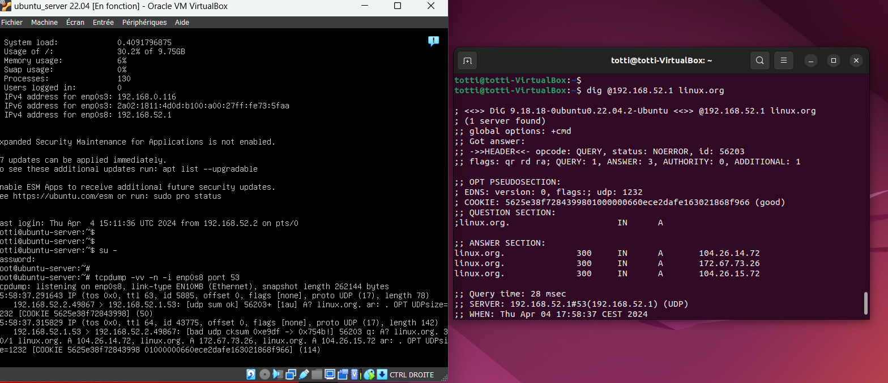
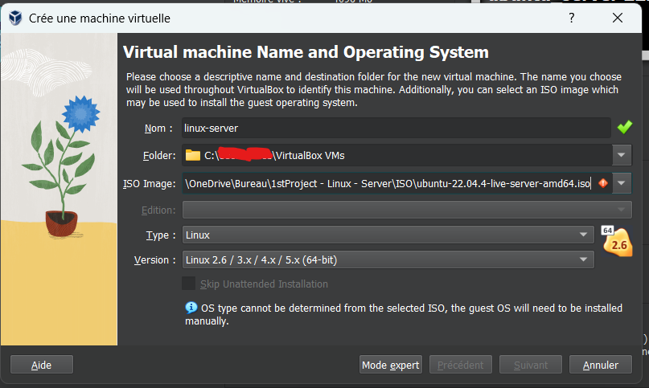
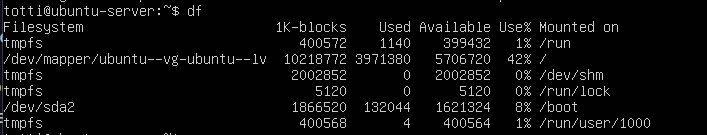
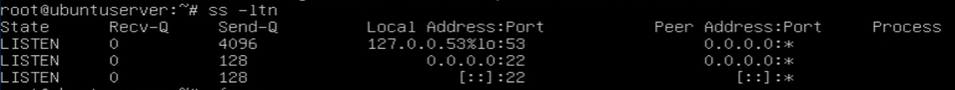
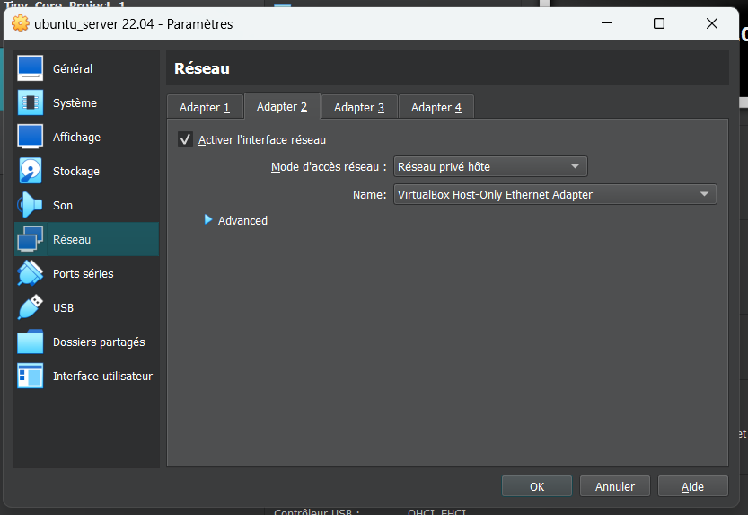
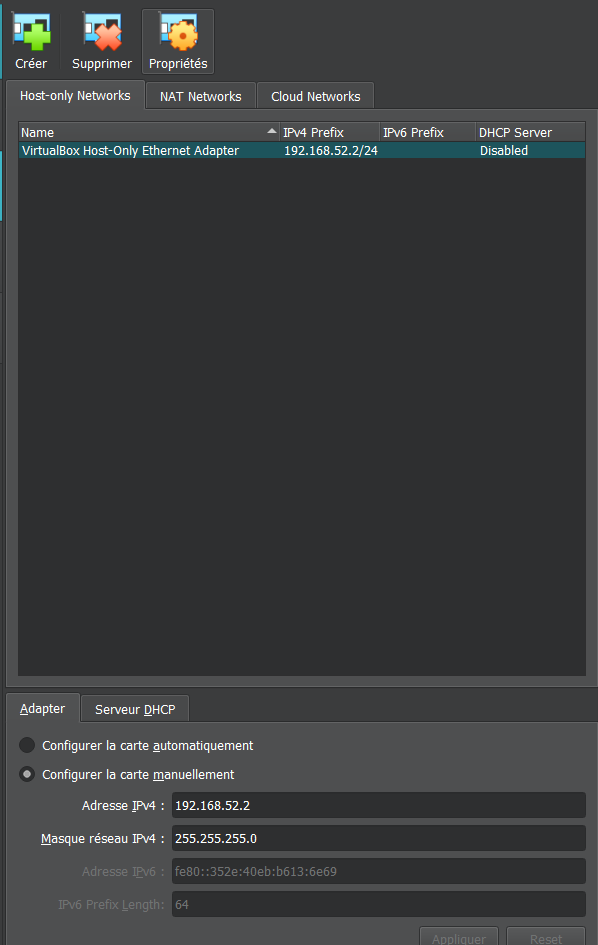
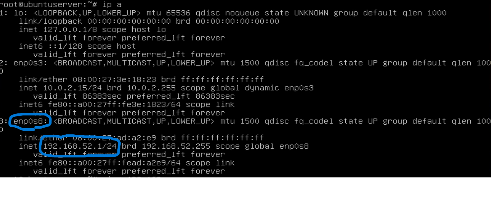
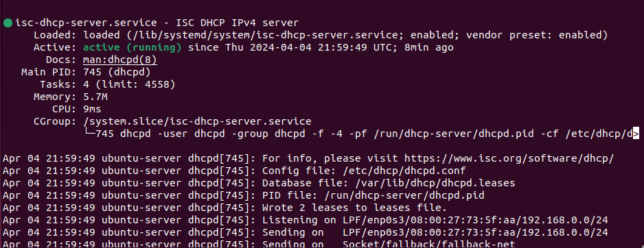
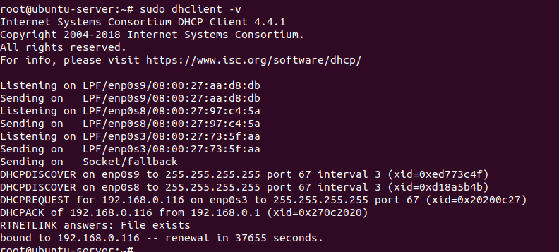
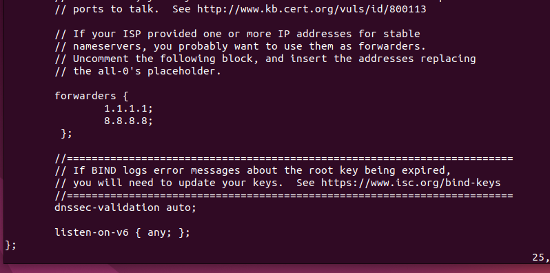

# Project Linux server and desktop
1st linux project - Kamkar 04.24

## Project context 
The local library in your little town has no funding for Windows licenses so the director is considering Linux. Some users are sceptical and ask for a demo. The local IT company where you work is taking up the project and you are in charge of setting up a server and a workstation.
To demonstrate this setup, you will use virtual machines and an internal virtual network (your DHCP must not interfere with the LAN).

You may propose any additional functionality you consider interesting.

## Must Have

Set up the following Linux infrastructure:

1. One server (no GUI) running the following services:
    - DHCP (one scope serving the local internal network)  isc-dhcp-server
    - DNS (resolve internal resources, a redirector is used for external resources) bind
    - HTTP+ mariadb (internal website running GLPI)
    - **Required**
        1. Weekly backup the configuration files for each service into one single compressed archive
        2. The server is remotely manageable (SSH)
    - **Optional**
        1. Backups are placed on a partition located on  separate disk, this partition must be mounted for the backup, then unmounted

2. One workstation running a desktop environment and the following apps:
    - LibreOffice
    - Gimp
    - Mullvad browser
    - **Required** 
        1. This workstation uses automatic addressing
        2. The /home folder is located on a separate partition, same disk 
    - **Optional**
        1. Propose and implement a solution to remotely help a user

----------------------------------------------------------------------------------------------

In this project you can find a setup with a desktop (Ubuntu Linux) and a server (Linux server) within a virtualized environment on Oracle virtual box

In this repository you can find the configuration of two virtual machines: 

- Server: Ubuntu 22.04.4 TLS
- Desktop: Ubuntu server 22.04

The server is installed without GUI.



Let's discover the differents configurations made for this project:

- Server configuration --> linux-server-config.md
- Desktop configuration --> linux-desktop-config.md


# Server Ubuntu VM:

Settings:
- 4096 Mo of RAM
- 3 CPU cores
- 20 GB of storage
- Adaptater 1 : Bridged network adapter
- Adaptater 2 : Private Host 
- Network manager CFG (Virtual box) : ipv4 : 192.168.52.2 DHCP: Disabled
- Ubuntu 22.04 LTS Server Edition
- Hostname: `ubuntu-server`

### __1. Creating the New VM__

First of all you need to download your .iso file. 

You can get one in the following link: [ubuntu-22.04-iso](https://ubuntu.com/download/server)

Once the ISO downloaded, we can set up the new VM on VirtualBox.

Click on New button, fill out the name, select the ISO you just downloaded.



Press "Next" and there you can set up your username with password and the hostname of the server.

Allocate 4096MB of RAM;
Allocate 20GB of hard drive space or more. (Depending on the space in your host computer)

Finish.

------------------------------------------------------------------------------------

### __2. Installing Linux on the VM__

Select your language: I choosed English by default.

Configure the keyboard: 
- Layout: Belgian
- Variant: Belgian

Done.

Choose the base for the installation:
- Ubuntu server

Done.

## Network connections

Don't touch nothing and just press done.

Same for "Configure proxy", "Configure ubuntu archive mirror" just press done, we don't need to set up one for this project.

## Guided storage configuration

You can leave it by default also:
- Use an entire disk
- Set up this disk as an LVM group

Done.

## Storage configuration

I left the configuration by default also.

Done and you can confirm destructive action.

## Profile setup

- Your name: Totti K
- Your servers name: ubuntu-server
- Pick a username: totti
- choose a password: ******
- Confirm it.

Done.

## SSH setup

I didn't Installed open SSH server we will configure it later, same for Feature Server Snaps.

Congrats! You can take a coffee during the installation of your server. x-)

When it's done you can press on "Reboot now"

### __3. Setting Up the VM__

Now let's get down to business and start configuring the server!

As you can see, it's quite annoying to 'not be able' to do what you want because you're only faced with a terminal.

So I wanted to simplify my life and set up an SSH connection directly with my desktop (which I'd already installed upstream).

But first let's do some basic configuration, which will be necessary for the rest of the operation.

## Steps

### __1. Install sudo and add user to sudoers__

Install sudo and add your user to the sudoers group:
```sh
su root
```
```sh
apt install sudo
```
```sh
usermod -aG sudo YOUR_USERNAME
```
```sh
exit
```

Test sudo and privilege:
```sh
sudo apt update
```

I've also added few nice commands to get information from your new fresh server. They are in the commands file.

Here below you can see 1 nice example to get information that we will need to set up our SSH connection, DHCP, DNS,etc.

The df command displays information about total space and available space on a file system. The FileSystem parameter specifies the name of the device on which the file system resides, the directory on which the file system is mounted, or the relative path name of a file system.
```sh
df
```


### __2. Installation of SSH__

I will put the sudo command to have the full syntax but to make this configuration it's better that you take your root privilege directly to avoid using "sudo" in the syntax of your command.

Root privileges
```sh
su -
```

Install the ssh package via sudo
```sh
sudo apt install ssh
```

Check the systemctl status
```sh
sudo systemctl status ssh
```
If the service is active(running), then it's ok.

We want to check if we are really listening to port 22 so we will use this command.
```sh
ss -ltn
```
As you can see on the image we are listening by default on port 22.



Let's enable the firewall to allow ssh port connection.
```sh
sudo ufw enable
```
We will allow our firewall to accept those ports:
```sh
sudo ufw allow 22/tcp
```

We can check if it's well allowed by using
```sh
sudo ufw status
```

Now let's go the change the configuration of the interface ipv4 for the ssh connection
```sh
cd /etc/netplan
```

Make a copy of 00-installer-config.yaml and rename it.
```sh
cp 00-installer-config.yaml 01-enp0s8-config.yaml
```
Let's configure it!
```sh
sudo vim 01-enp0s8-config.yaml
```
  - Add the following configuration to the file:
     ```bash
network:
  ethernets:
  enp0s8:
   addresses:
   - 192.168.52.1/24
   nameservers: {}
  version: 2
    ```

After that switch of the machine using

```sh
init 0
```

# Why are we using the interface enp0s8 and the ip address 192.168.52.1/24 ?

Because in our software Oracle Virtual box we gonna change the settings of the virtual machine and add another interface to configure a static ip address to allow the configuration for the SSH and also for the GLPI.



After adding the adaptater 2 you have also to go in Files --> Tools --> Network Manager and there under the tab "Host-Only Networks" you set up your static ip address (don't forget to disable dhcp server)



You are now ready to establish your SSH connection! (You can even try it via your host computer)

Turn on your server and first let's check if the settings are correctly made

```sh
ip a
```
You should get this result, as you can see enp0s8 have a static ip address 192.168.52.1



Now just open your VM desktop (if already mounted) or just try with your host computer to enter in the server via ssh connection.
```sh
ssh YOUR_USERNAME@192.168.52.1
```

### Configuring DHCP Server

1. **Install ISC DHCP Server**:
   ```bash
   sudo apt install isc-dhcp-server -y
   ```

2. **Configure DHCP Server**:
   - First we will edit dhcpd.conf file.
    ```bash
     sudo vim /etc/dhcp/dhcpd.conf
    ```
   - We add the following configuration to the file:
    ```bash
    subnet 192.168.0.0 netmask 255.255.255.0 {
        range 192.168.0.100 192.168.0.200;
        option domain-name-servers 192.168.0.1; 
        option routers 192.168.0.1; 
        option broadcast-address 192.168.0.255;
        default-lease-time 600;
        max-lease-time 7200;
    }
    ```

1. **Specify the Network Interface**:
   - Now we will edit "isc-dhcp-server" file to specify the interface DHCP.
    ```bash
     sudo vim /etc/default/isc-dhcp-server
     ```
   - and once inside we set the `INTERFACESv4` variable to our server's network interface. Now it will be "enp0s3"
  
         ```bash
INTERFACESv4="enp0s3"
INTERFACESv6=""
    ```
  
2. **Start and Enable DHCP Service**:
   ```bash
   sudo systemctl restart isc-dhcp-server
   sudo systemctl enable isc-dhcp-server
   sudo systemctl status isc-dhcp-server
    ```
    
  

DHCP service is now active.

By doing the following command you can see that we get a:
- DHCP Discover
- DHCP REQUEST
- DHCP ACK

   ```bash
   sudo dhclient -v
   ```
  

 ### Setting Up a DNS Server with BIND

1. **Install BIND**:
   ```bash
   sudo apt install bind9
   ```

2. **Configure DNS Server**:
    - Edit the BIND configuration file.
     ```bash
      sudo vim /etc/bind/named.conf.options
     ```
    - Add the following configuration to the file:
     ```bash
     forwarders {
        1.1.1.1;
        8.8.8.8.;
    };
    ```
- 1.1.1.1 = Cloudflare DNS
- 8.8.8.8 = Google DNS
  After that you can try to ping them to check if the connectivity is working.

     /!\ Remove well the // in the front of each line !
  
   

There is also a service included with systemd called resolved and we have to disable this service in order to put Bind9 being used as our main DNS resolution service.

So let's stop first this service and we will also disable it.
   ```bash
   sudo systemctl stop systemd-resolved
   sudo systemctl disable systemd-resolved
   ```
Let's open another file in cd/run/systemd/resolve
   ```bash
sudo vim /run/systemd/resolve/stub-resolv.conf
   ```
   
   
 **Start and Enable BIND**:
   ```bash
   sudo systemctl restart bind9
   sudo systemctl enable bind9
   ```

 **Verify DNS Configuration**:
    - Check the status of the BIND service.
    ```bash
      sudo systemctl status bind9
      ```
     

    The DNS server is now running and ready to resolve domain names for clients on the network.

    Testing the DNS server...

    ```bash
    nslookup google.com
      ```
